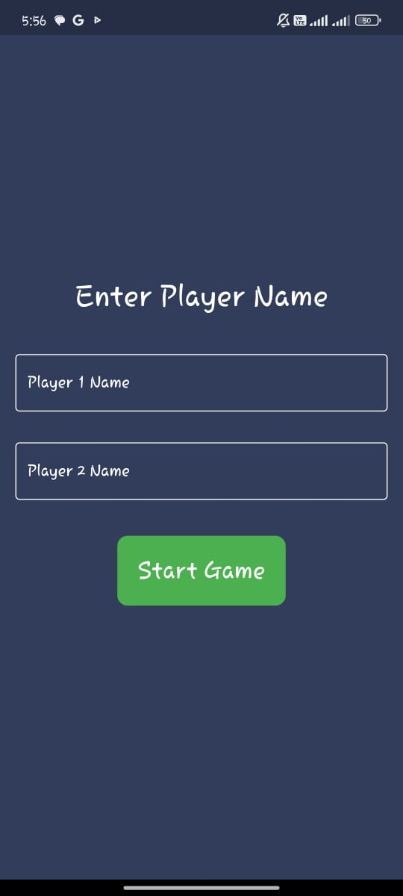
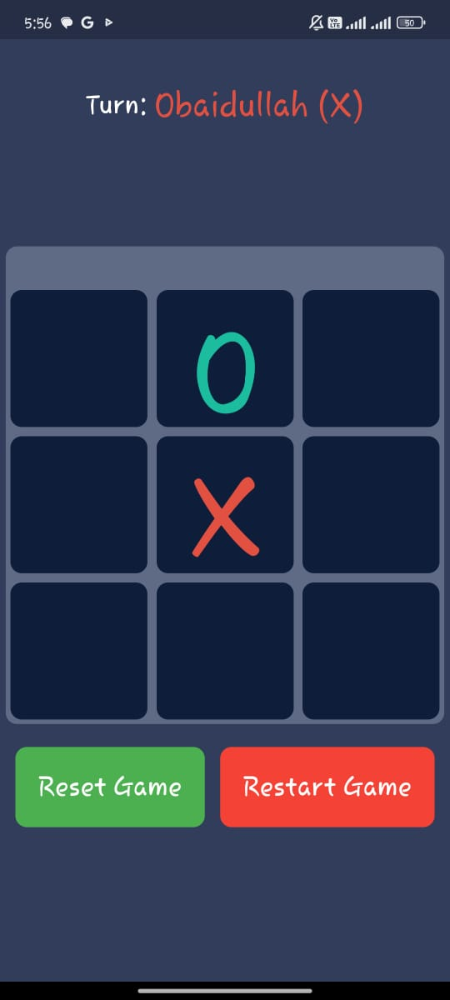
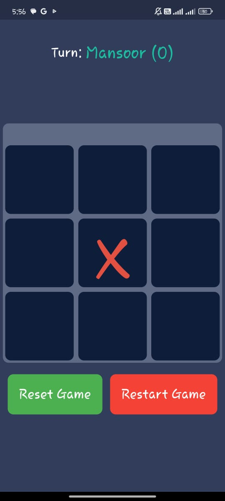

# Tic-Tac-Toe Game (Flutter)

A simple Tic-Tac-Toe game built using Flutter! This app provides a fun and interactive way to play the classic game. It features a modern UI with responsive layouts, smooth animations, and a user-friendly interface. You can play in single-player mode against an AI or challenge a friend in local multiplayer mode.

## Features

- **Single Player Mode**: Play against a basic AI.
- **Multiplayer Mode**: Play locally with a friend.
- **Modern UI**: Beautiful interface with a sleek design.
- **Responsive Design**: Works on various screen sizes.
- **Interactive Animations**: Smooth transitions and button interactions.

## Screenshots

### Home Screen
The home screen provides options to start the game in single or multiplayer mode.


### In-Game Screen (Multiplayer)
Play against a friend with the simple and intuitive game board.


### In-Game Screen (Single Player)
Challenge the AI and try to win the game!


## Getting Started

### Prerequisites

- [Flutter SDK](https://flutter.dev/docs/get-started/install) installed on your system.
- A code editor like [VS Code](https://code.visualstudio.com/) or [Android Studio](https://developer.android.com/studio).

### Installation

1. Clone the repository:
   ```bash
   git clone https://github.com/obaidullah72/tic-tac-toe-flutter.git
   ```

2. Navigate to the project directory:
   ```bash
   cd tic-tac-toe-flutter
   ```

3. Install the dependencies:
   ```bash
   flutter pub get
   ```

4. Run the app:
   ```bash
   flutter run
   ```

## How to Play

- Select Single Player or Multiplayer from the home screen.
- For **Single Player**, you will be playing against the AI, and in **Multiplayer**, you can play with a friend on the same device.
- Tap on any empty tile to place your mark (X or O).
- The first player to align three marks (horizontally, vertically, or diagonally) wins!
- If no one wins and all tiles are filled, the game is a draw.

## Built With

- [Flutter](https://flutter.dev/) - The UI framework used.
- Dart - The programming language used.

## Contributing

Contributions are welcome! Please feel free to submit a pull request or open an issue if you find any bugs or have suggestions for new features.

## License

This project is licensed under the MIT License - see the [LICENSE](LICENSE) file for details.

---

**Enjoy playing Tic-Tac-Toe!**
